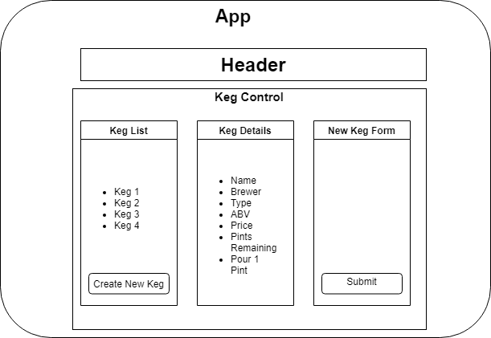

# Tap Room
Web application for tracking and managing taps.

### Authored by:" Anthony McRae

* Technologies:
* React.js
* CSS
* Node.js
* JavaScpript
* React-Bootstrap

## Componet Diagram


## Description
* A user can see a list/menu of all available kegs. 
* A user can see each keg's name, brand, price and alcohol content(ABV). 
* A user can add a new keg to a list by clicking a button to go to keg's detail page. 
* A user can see how many pints are left in a keg(roughly 124 pints). 
* A user is able to click a button next to a keg to sell a pint of it which decreases the number of pints left by 1. Pints are not be able to go below 0.

## Setup and Usage Instructions
### Technology Requirements
* Download and install a code text editor. Ex: VS Code
### Installation
* Clone this repository, or download and open the Zip on your local machine

* Open the tap-room folder in your preferred text editor

* To install required packages, navigate to the tap-room directory in the terminal and type the following command: ```npm install```
   * To run the project:

* Navigate to the tap-room folder in the command line or terminal
* Run the command ```"npm start"```

Known Issues:
* None

## License
This project is licensed uder the MIT License.